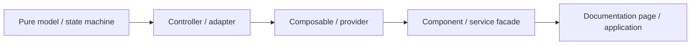

<!-- cspell:words allowlist roving XHR -->

# Layering and State Ownership

- Date: 2026-07-31
- ElfUI Kit: `0.0.2-beta.1`
- ElfUI Core / Compiler / Vite Plugin: `0.1.0-beta.20`
- Work package: `OP-02`
- Status: authoritative design boundary for the current repository

This document fixes the dependency direction, state owner, and permitted design patterns for eight shared domains. It describes both the current repository and the intended extraction boundary. A target split is not evidence that its implementation work package is complete.

The current framework contracts were checked against `E:\elfui-docs`: logical `provide` / `inject` context survives Shadow DOM and Teleport, mounted resources must return or register deterministic cleanup, Core form controls own native `ElementInternals`, and Core `Transition`, `TransitionGroup`, `Teleport`, and `useScrollLock` own their documented structural or browser behavior.

## Repository Dependency Rule



An arrow means that the layer on the right may consume the stable contract on the left. Dependencies must not point back from a lower layer to a component or page implementation.

- Pure models contain deterministic state transitions or calculations and do not own DOM resources.
- Controllers own a browser resource or transaction and release it in the same lifecycle boundary in which it was acquired.
- Adapters translate a framework, browser, or third-party contract into one domain protocol.
- Composables and Providers connect domain contracts to the logical component tree. Providers own policy and context, not consumer instances.
- Components own public Custom Element contracts, rendering, controlled/uncontrolled coordination, ARIA, and component-specific state.
- Service facades normalize public calls and delegate to service-owned instance controllers. They do not move service state into a Provider.
- Pages consume public components. No source under `src/components`, `src/composables`, `src/utils`, or `src/adapters` may import `src/pages`.
- Shared contract types belong at the lowest layer that defines their meaning. Type-only cycles are still design debt even though they do not create a runtime cycle.

## Pattern Admission

| Pattern       | Use when                                                                           | Current or planned example                                                            | Do not use for                                                                                    |
| ------------- | ---------------------------------------------------------------------------------- | ------------------------------------------------------------------------------------- | ------------------------------------------------------------------------------------------------- |
| State Machine | A finite set of states has guarded transitions, cancellation, or terminal cleanup  | Overlay `inactive -> active -> closing -> inactive`; planned Upload task transitions  | Boolean aliases that can represent contradictory states                                           |
| Strategy      | A caller selects one replaceable algorithm behind a stable contract                | `DateAdapter`; Upload request and chunk strategies                                    | A wrapper around one fixed function with no variation                                             |
| Adapter       | External or framework semantics must be translated without leaking into the domain | `useDateAdapter`; planned native form association; overlay lifecycle composables      | Renaming parameters while preserving the same concrete dependency                                 |
| Controller    | One owner must coordinate resources, ordering, cancellation, or cleanup            | Overlay interaction/focus controllers; service stacks; planned Upload task controller | Pure calculations or view-only formatting                                                         |
| Facade        | A stable public entry point composes smaller owners without copying their state    | ConfigProvider context, Form expose API, `ElfMessage*` and `useMessage*` service APIs | A universal object that merges unrelated collection, overlay, form, layout, and service semantics |

Deep component inheritance is not an approved extension mechanism. Prefer composition through public props, events, slots, expose methods, injection contexts, and small domain contracts.

## 1. Overlay

### Dependency direction

```text
overlay-protocol + overlay-stack
  -> overlay-interaction-controller
    -> focus-scope + modal-overlay-controller / anchored-overlay lifecycle
      -> useModalOverlay / useDismissibleOverlay
        -> Dialog, Drawer, MessageBox, Menu, Select, Picker and other overlay components
          -> pages
```

`anchored-overlay.ts` currently contains both pure placement calculations and the active browser-resource connector. That file remains the owner until `OP-07` has evidence for a split; consumers must not copy either half.

| State or side effect                         | Sole owner                                                                                  |
| -------------------------------------------- | ------------------------------------------------------------------------------------------- |
| Lifecycle state and close reason             | `overlay-protocol.ts`                                                                       |
| Topmost membership and physical-event claim  | `overlay-stack.ts`                                                                          |
| Stack/lifecycle composition                  | `overlay-interaction-controller.ts`                                                         |
| Deep Shadow DOM focus capture/trap/restore   | `focus/focus-scope.ts` through `modal-overlay-controller.ts`                                |
| Concurrent document scroll lock              | Core beta.20 `useScrollLock`                                                                |
| Anchored placement calculation               | `computeAnchoredPosition()`                                                                 |
| Resize, scroll, wheel and viewport cleanup   | `connectAnchoredOverlayLifecycle()`                                                         |
| Public open model, guard, ARIA and rendering | The consuming component                                                                     |
| Structural enter/leave                       | Core `Transition` when its lifecycle contract fits; the component supplies names and policy |

Forbidden edges include component-local Escape/outside stacks, independent global z-index counters, direct writes to `document.body.style.overflow`, manual DOM moves in place of `Teleport`, and access to another component's Shadow DOM.

Resolved `OP-03` boundary: Core `useScrollLock` owns both declarative and service-created Loading locks. `src/components/Feedback/Loading/service.ts` sets the public `lock` prop before connecting the component and does not write body overflow or maintain a second owner counter. Mixed-owner regression tests cover concurrent close order and restoration of the original overflow value.

## 2. Field and Form

### Dependency direction

```text
path + validation rules
  -> Form/FormItem context and validation controller
    -> form composables + field-value defaults
      -> field components
        -> forms and pages
```

| State or side effect                                | Sole owner                                                                                          |
| --------------------------------------------------- | --------------------------------------------------------------------------------------------------- |
| Path read/write and rule evaluation                 | `src/utils/path.ts` and `src/utils/validator.ts`                                                    |
| Field registration and aggregate validate/reset     | Form                                                                                                |
| Initial value, validation run, message and status   | FormItem                                                                                            |
| Model/event/validation-trigger bridge               | `useFormControl()`                                                                                  |
| Disabled and size inheritance                       | `useDisabled()`, `useSize()`, and the Form/FormItem injection context                               |
| Empty values and clear-value precedence             | `field-values.ts` plus `ConfigProvider.config.field`                                                |
| Field-specific parsing, formatting and clear result | The concrete field component                                                                        |
| Native form submission/reset/restore/disabled       | Planned adapter over Core `useFormControlContext`; it must sit below the Kit Form/FormItem contract |

Component explicit props override Provider field defaults. The Provider stores policy only and does not interpret Select, number, date, or range values.

Current type-layer debt is explicit: `src/utils/validator.ts`, `src/composables/form.ts`, and `src/types/form-context.ts` import Form component contract types. The behavioral owner is stable, but the shared rule/context types must move below the component layer during `EP-01` / `OP-03`; new lower layers may not add further component-type imports.

Core native form association is complementary, not a replacement for Form/FormItem validation. Adoption requires reset, state restore, disabled fieldset, serialization, required, and validation interaction tests.

## 3. Collection

There is deliberately no universal collection owner. Similar keys and indices do not make Tree, Table, Menu, Tabs, and Select state transitions equivalent.

| Domain | Current model/state owner                | State that must stay local                                                        |
| ------ | ---------------------------------------- | --------------------------------------------------------------------------------- |
| Tree   | `Data/Tree/tree-collection.ts` and Tree  | Hierarchy, expand, cascade check, lazy load, drag transaction                     |
| Table  | Table row/column/selection/filter models | Row/column projection, sort/filter/selection, fixed regions                       |
| Menu   | `Navigation/Menu/model.ts` and Menu      | Light DOM hierarchy, typeahead, submenu open path, roving focus                   |
| Tabs   | Tabs and TabPane public composition      | Controlled active value, roving focus, overflow, drag transaction                 |
| Select | Select                                   | Form value, option selection, remote state, active option and overlay interaction |

A shared pure collection protocol may be introduced only after three semantically aligned consumers need the same stable-key diagnostics, enabled-item navigation, or key normalization. Hierarchy, cascade selection, async loading, form submission, DOM composition, and virtualization must not be combined into that abstraction.

TreeSelect and other macro components consume the public contract of their child domain. They must not inspect or mutate child Shadow DOM or establish a second state model.

## 4. Virtual Window

### Dependency direction

```text
src/utils/virtual-window.ts
  -> src/components/Data/virtual-window.ts compatibility re-export
    -> VirtualList, Table, Tree, Transfer and Select measurement/view controllers
      -> pages
```

| State or side effect                                | Sole owner                                                            |
| --------------------------------------------------- | --------------------------------------------------------------------- |
| Fixed/variable range, offset and total-size math    | `src/utils/virtual-window.ts`                                         |
| Compatibility export                                | `src/components/Data/virtual-window.ts`; no algorithm is allowed here |
| Measurement cache and estimate policy               | The consuming virtual component                                       |
| Scroll offset, focused item and DOM synchronization | The consuming component/controller                                    |

The pure contract keeps `start` inclusive and `end` exclusive. It normalizes invalid inputs, clamps stale offsets, and does not create a full-data mapping in the scroll hot path. Components may cache results, but may not fork the range algorithm.

## 5. Date

### Dependency direction

```text
DateAdapter strategy + native adapter
  -> ConfigProvider date options + locale context
    -> useDateAdapter facade
      -> Calendar, DatePicker and DateTimePicker domain state
        -> pages
```

| State or side effect                          | Sole owner                                                                  |
| --------------------------------------------- | --------------------------------------------------------------------------- |
| Parse, format, compare, add and calendar math | `src/adapters/date.ts` `DateAdapter` strategy                               |
| Adapter choice, locale, time zone and formats | Nearest ConfigProvider read through `useDateAdapter()`                      |
| Selected value/range and panel navigation     | The concrete picker or Calendar state machine                               |
| Time-only value and option generation         | TimePicker/TimeSelect domain, composed with date contracts where applicable |
| Overlay lifecycle                             | Shared overlay owners, not the date adapter                                 |

The adapter is a Strategy because applications may replace the algorithm. `useDateAdapter()` is the tree-context Adapter/Facade and must remain thin. Picker components must not copy date parsing, comparison, range, locale, or time-zone arithmetic.

## 6. Upload

Upload currently has one implementation owner, `src/components/Form/Upload/index.ts`, but it mixes file state, validation, requests, XHR, chunking, timers, object URLs, events, and rendering. This is a recorded boundary violation and does not mean `EP-04` is complete.

### Target dependency direction

```text
upload model + validation policy
  -> request Strategy (custom / XHR / chunk)
    -> task Controller (abort, progress, timers, object URLs, cleanup)
      -> Upload component facade and view
        -> Upload pages
```

| State or side effect                                      | Target sole owner                                                                |
| --------------------------------------------------------- | -------------------------------------------------------------------------------- |
| `ready -> uploading -> success/error` transitions         | Upload task state machine                                                        |
| Accept, size, name and before-upload decisions            | Pure validation policy                                                           |
| Custom, XHR and chunk request differences                 | `UploadRequest` Strategy adapters                                                |
| Active request/timer registry and abort                   | Upload task Controller                                                           |
| Object URL acquire/revoke                                 | The same task resource Controller                                                |
| Controlled list priority and public event payloads        | Upload component Facade                                                          |
| File list, slots, focus and `TransitionGroup` integration | Upload view; structural animation waits for the complete `EP-04` lifecycle tests |

The extraction must preserve Element Plus names and payloads at the public boundary while consuming one normalized internal task shape. It must cover abort, retry, concurrent requests, rapid removal, `clearFiles()`, object URL release, unmount, request errors, and controlled updates. No framework workaround or manual list animation is allowed.

## 7. Layout

Current Layout components own only their own appearance and local structure:

- Layout owns explicit direction and direct `elf-aside` detection.
- Aside, Main, Footer, AppBar, and BottomNavigation own their public props and rendering.
- ConfigProvider does not yet provide an Application Layout registration context.

There is no authoritative owner for registered layout items, priority, edge occupancy, or main-content insets. This is the `VU-02` gap and must not be hidden with consumer-specific padding or a second skeleton component.

### Target dependency direction

```text
layout item model + inset calculation
  -> Application Layout controller/context
    -> AppBar, BottomNavigation, Footer and Aside registration adapters
      -> Main/content consumer
        -> pages
```

The future controller owns registration identity, edge, order/priority, active size, cleanup, and LTR/RTL inset calculation. Each surface still owns its visual style. Implementation requires desktop/mobile, LTR/RTL, dynamic mount/unmount, priority, SSR/hydration, and main inset browser evidence before `VU-02` can close.

## 8. Services

### Dependency direction

```text
ConfigProvider service default policy
  -> resolveServiceOptions shallow merge
    -> service-specific instance Controller and component
      -> ElfService / useService facade
        -> application or component consumer
```

| State or side effect                                   | Sole owner                                                 |
| ------------------------------------------------------ | ---------------------------------------------------------- |
| Default option policy                                  | `Providers/service-defaults.ts` and ConfigProvider context |
| Message top/bottom stacks and timers                   | Message service                                            |
| Notification corner stacks, append target and timers   | Notification service                                       |
| Active dialogs, promise settlement and hash cleanup    | MessageBox service and its modal component                 |
| Loading target geometry, instances and target position | Loading service; Core `useScrollLock` owns body locking    |
| Detached theme/locale application                      | Provider context adapters consumed by each service         |

Service option merging remains shallow because callbacks, Nodes, request targets, and strategy objects are atomic. Providers must not create service instances, timers, DOM nodes, stacks, or cleanup callbacks. Each service must make `close()` idempotent and release listeners, timers, stack membership, focus, geometry, and component nodes exactly once.

Detached services may create component hosts because they are facades over those public components. They may not reproduce a component's internal template or query internal Shadow DOM to drive behavior.

## Enforced Boundaries

`scripts/architecture-boundaries.test.ts` guards the design against silent drift:

1. all eight domains, five admitted patterns, owners, and known gaps remain documented;
2. lower layers cannot import documentation pages;
3. the selected foundation graph remains acyclic;
4. the virtual-window and date pure owners do not gain upward dependencies;
5. Common focus/overlay foundations import only within their shared domain;
6. service-default policy remains free of DOM instances, listeners, timers, and request resources;
7. no lower-layer module writes body overflow or introduces a Loading-specific lock counter; service instances delegate locking to Core through the public component prop.

The test is a boundary guard, not proof that every future extraction is implemented. Component behavior, browser cleanup, SSR, performance, and screenshots remain the responsibility of the named follow-up work package.

## Migration Ledger

| Current gap                                                                  | Owning work package | Closure evidence                                                                                      |
| ---------------------------------------------------------------------------- | ------------------- | ----------------------------------------------------------------------------------------------------- |
| Form contract types point upward and native form association is absent       | `EP-01` / `OP-03`   | Lower-layer contract extraction plus native submit/reset/restore/disabled and validation tests        |
| Anchored overlay container, z-index and scaled coordinates remain incomplete | `OP-07`             | Controller tests and real Visual Viewport/container browser matrix                                    |
| Upload is a mixed component/resource/request owner                           | `EP-04`             | State machine, request Strategy, resource Controller, focused tests, performance and browser evidence |
| Application Layout owner does not exist                                      | `VU-02`             | Registration/context implementation and desktop/mobile LTR/RTL/SSR screenshots                        |
| Platform/Display/SSR is only partially represented by ConfigProvider display | `VU-03`             | One platform/display owner, hydration tests and first-frame browser evidence                          |
| Provider service option types depend on concrete service types               | `OP-09`             | Generated lower-layer service metadata/types with consumer build evidence                             |
